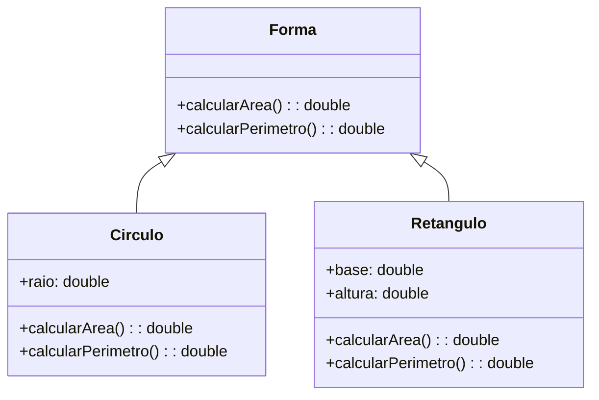
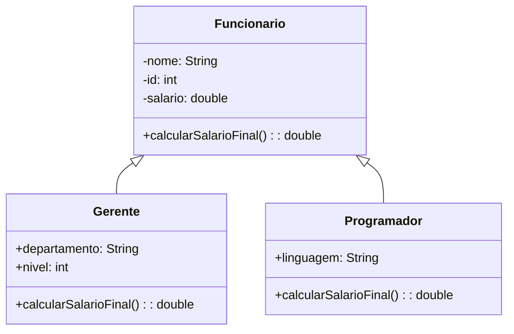
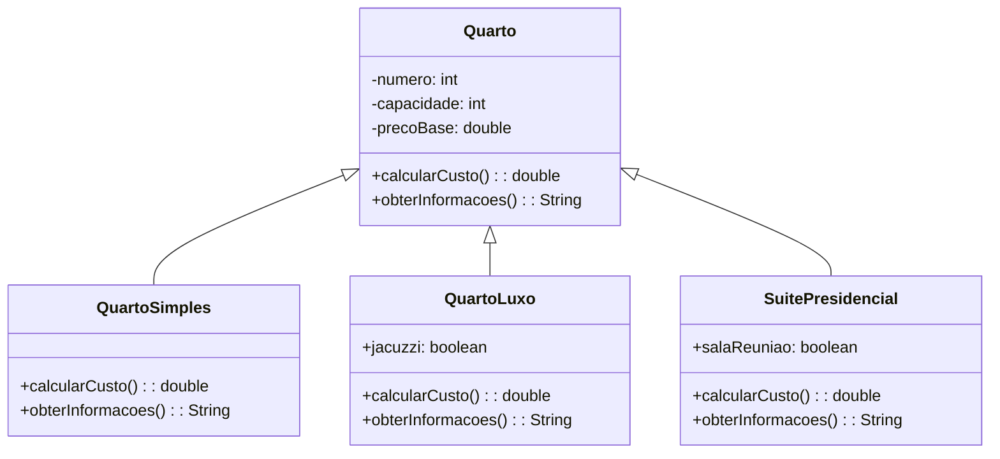

**Questão 1:**

Considere uma hierarquia de classes representando diferentes formas geométricas. Crie uma classe base chamada `Forma` com métodos para calcular a área e o perímetro. Derive duas classes, `Circulo` e `Retangulo`, que herdam da classe `Forma`. Implemente os métodos necessários para cada forma e forneça um exemplo de uso.

**Diagrama de Classe (Mermaid):**

**Questão 2:**

Você está desenvolvendo um sistema de gerenciamento de funcionários. Crie uma classe base chamada `Funcionario` com atributos como nome, ID e salário. Derive duas classes, `Gerente` e `Programador`, que herdam da classe `Funcionario`. Adicione métodos específicos para cada classe, como `calcularBonificacao()` para o Gerente e `calcularSalarioFinal()` para o Programador. O salario final de um gerente é o salario multiplicado pela nivel. O salário de um programador tem um acrescimo de 50% se a linguagem dele for "Java".

**Diagrama de Classe:**

**Questão 3:**

Você está implementando um sistema de reservas em um hotel. Crie uma hierarquia de classes para representar diferentes tipos de quartos: `QuartoSimples`, `QuartoLuxo` e `SuitePresidencial`. Use herança para garantir a reutilização de código. Cada classe deve ter métodos para calcular o custo da reserva e fornecer informações específicas do tipo de quarto. O custo da reserva é calculado multiplicando a capacidade pelo preço base. Quartos de luxo com jacuzzi tem um acrescimo de R\$ 50 e Suites Presidenciais com Sala de Reuniões têm um acrescimo de R\$ 200.

**Diagrama de Classe:**

